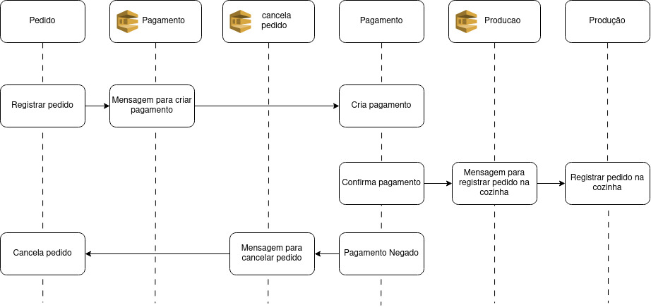
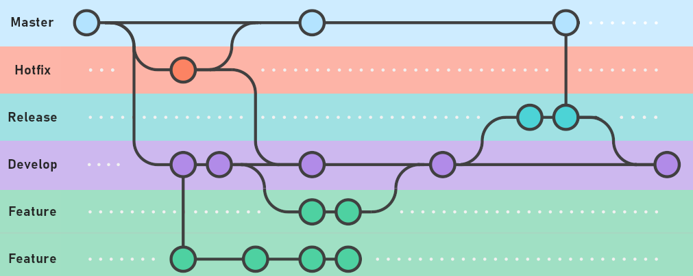

# Tech Challenge - 4 - pedido

## Introdução
Este repositório contém o microserviço de pedidos, oferecendo as seguintes funcionalidades:
- **customer (POST)** - Criar um novo cliente.
- **find by cpf (GET)** - Buscar um cliente pelo CPF.
- **checkout (POST)** - Criar um novo pedido.
- **checkout without customer (POST)** - Criar um pedido sem informar o cliente.
- **order (GET)** - Buscar um pedido pelo ID.
- **product (POST)** - Criar um novo produto.
- **product (PUT)** - Atualizar um produto existente.
- **product list (GET)** - Listar todos os produtos.
- **find by category (GET)** - Buscar produtos por categoria.
- **product (REMOVE)** - Remover um produto.
- **customer/request-delete (POST)** - solicitar remoção dos dados de um cliente

## SAGA
Para aumentar a autonomia de cada microserviço, optamos por utilizar o padrão SAGA de forma coreografada.

#### Justificativa do SAGA
Em sistemas baseados em microserviços, onde várias transações distribuídas precisam ser coordenadas de maneira confiável, o padrão SAGA se mostra uma solução eficaz.

1. Autonomia dos Microserviços:
   Utilizar SAGA permite que cada microserviço mantenha a sua autonomia, controlando suas próprias transações sem depender de um coordenador central. Isso resulta em uma arquitetura mais resiliente e escalável.
2. Consistência Eventual:
   Em um ambiente distribuído, garantir a consistência imediata pode ser difícil e caro. Com SAGA, adotamos o princípio da consistência eventual, permitindo que os dados eventualmente atinjam um estado consistente após a conclusão de todas as etapas da transação.

3. Facilidade de Recuperação e Compensação:
   O SAGA define explicitamente as ações de compensação para desfazer mudanças parciais em caso de falhas. Isso simplifica a lógica de recuperação e minimiza o impacto de erros, tornando o sistema mais robusto.

4. Escalabilidade:
   Ao eliminar a necessidade de uma transação distribuída única e centralizada, os microserviços podem ser escalados independentemente, melhorando a performance e a capacidade de resposta do sistema como um todo.

5. Redução de Acoplamento:
   A coreografia de SAGA promove um baixo acoplamento entre os microserviços. Cada serviço executa suas operações e emite eventos que outros serviços reagem, em vez de depender de chamadas síncronas entre serviços.

## LGPD RIPD

Para garantir a conformidade com a LGPD, foi elaborado um Relatório de Impacto à Proteção de Dados Pessoais. Você pode acessá-lo aqui:

[RELATÓRIO DE IMPACTO À PROTEÇÃO DE DADOS PESSOAIS](./doc/RIPD.pdf) 

## OWASP

Realizamos avaliações de segurança utilizando a ferramenta OWASP ZAP. Os relatórios das avaliações estão disponíveis nos links abaixo:

Antes das correções: [owasp antes](./doc/owasp_antes.pdf)
Depois das correções: [owasp depois](./doc/owasp_depois.pdf)

## Fluxo de Trabalho (Git Flow)
Adotamos o Git Flow para uma organização eficaz do desenvolvimento:

- **Master/Main**: Contém o código de produção.
- **Develop**: Base para o desenvolvimento de novas funcionalidades.
- **Feature Branches**: Desenvolvimento de novas funcionalidades em branches isoladas.
- **Release Branches**: Preparação de novas versões para lançamento.
- **Hotfix Branches**: Correções de bugs críticos em produção.

> **Importante**: Os merges são realizados através de Pull Requests, exigindo duas aprovações e a passagem bem-sucedida por testes unitários, testes integrados e análise do SonarQube.

## CI/CD Pipeline
O pipeline de CI/CD é ativado automaticamente após merges na branch principal, incluindo:

- **Build with Gradle**: Compilação do projeto com Gradle.
- **Run unit tests**: Execução de testes unitários.
- **Run integration tests**: Execução de testes de integração.
- **Run data migration**: Gerenciamento de migrações de dados.
- **Build Docker image**: Construção de imagem Docker do aplicativo.
- **Publish Docker image to Amazon ECR**: Publicação da imagem no ECR.
- **Deploy to Kubernetes**: Implementação no Kubernetes.
